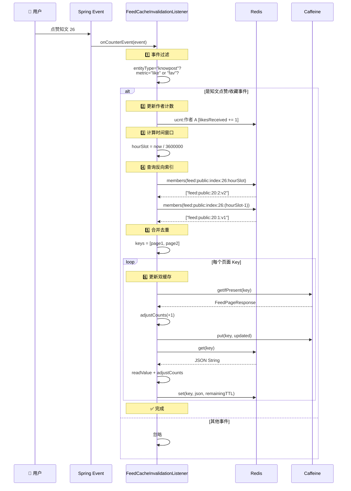

# Feed流缓存更新机制

## 反向索引结构（Redis）

```
Key: feed:public:index:{postId}:{hourSlot}
Type: Redis Set
Value: {
  "feed:public:20:1:v1",    ← 第 1 页版本 1
  "feed:public:20:2:v2",    ← 第 2 页版本 2
  ...
}
TTL: 7200s (2 小时)

示例：
feed:public:index:26:474898 → {"feed:public:20:1:v1", "feed:public:20:2:v2"}
```

**说明：**
- `postId`: 知文 ID
- `hourSlot`: 小时槽 = currentTimeMillis / 3600000
- 记录某篇知文出现在哪些 Feed 页面中
- 按小时分片，防止索引无限膨胀

---

## 正向索引结构（Redis + Caffeine）

### Redis 缓存（分布式）
```
Key: feed:public:{size}:{page}:{version}
Type: String (JSON)
Value: {
  "items": [
    {"id":"45", "title":"知文 45", "likeCount":50, "favCount":10},
    {"id":"44", "title":"知文 44", "likeCount":80, "favCount":20},
    ...
  ],
  "page": 1,
  "size": 20,
  "hasMore": true
}
TTL: 7200s (2 小时)

示例：
feed:public:20:1:v1 → JSON 字符串 (包含 20 条知文的完整信息)
```

### Caffeine 缓存（本地）
```java
Cache<String, FeedPageResponse> feedPublicCache = Caffeine.newBuilder()
    .maximumSize(10000)
    .expireAfterWrite(Duration.ofHours(2))
    .build();

Key: "feed:public:20:1:v1"
Value: FeedPageResponse 对象 (Java 对象，无需序列化)
```

---

## 目标：更新正向索引缓存

当知文的点赞/收藏数变化时，需要同步更新所有包含这篇知文的 Feed 页面缓存。

**核心问题：**
- 一篇知文可能出现在多个 Feed 页面中（历史版本）
- 如何快速定位这些页面？→ **反向索引**
- 如何保证所有页面计数一致？ → **批量更新**

---

## 总体流程图



---

## 数据结构变化

### 场景：知文 26 被点赞（从 100→101）

#### **更新前的数据**

```java
// 反向索引
Key: feed:public:index:26:474898
Value: {"feed:public:20:1:v1", "feed:public:20:2:v2"}

// 正向索引 - 第 1 页
Key: feed:public:20:1:v1
Value: {
  "items": [
    {"id":"45", "likeCount":50},
    {"id":"44", "likeCount":80},
    ...
    {"id":"26", "likeCount":100},  // ← 更新前
    ...
  ]
}

// 正向索引 - 第 2 页
Key: feed:public:20:2:v2
Value: {
  "items": [
    {"id":"26", "likeCount":100},  // ← 更新前
    {"id":"25", "likeCount":90},
    ...
  ]
}
```

---

#### **更新后的数据**

```java
// 反向索引（不变）
Key: feed:public:index:26:474898
Value: {"feed:public:20:1:v1", "feed:public:20:2:v2"}

// 正向索引 - 第 1 页（已更新）
Key: feed:public:20:1:v1
Value: {
  "items": [
    {"id":"45", "likeCount":50},
    {"id":"44", "likeCount":80},
    ...
    {"id":"26", "likeCount":101},  // ← 更新后 ✅
    ...
  ]
}
TTL: 保持剩余时间（不重置）

// 正向索引 - 第 2 页（已更新）
Key: feed:public:20:2:v2
Value: {
  "items": [
    {"id":"26", "likeCount":101},  // ← 更新后 ✅
    {"id":"25", "likeCount":90},
    ...
  ]
}
TTL: 保持剩余时间（不重置）

// Caffeine 本地缓存（同步更新）
feedPublicCache.put("feed:public:20:1:v1", updatedPage1);
feedPublicCache.put("feed:public:20:2:v2", updatedPage2);
```

---

## 关键设计要点

### 1. 时间窗口的作用

| 方案 | 优点 | 缺点 |
|------|------|------|
| **全局索引**<br>`feed:public:index:26` | 简单直观 | ❌ 索引无限增长<br/>❌ 查询越来越慢<br/>❌ 内存浪费 |
| **小时槽分片**<br>`feed:public:index:26:474898` | ✅ 范围固定<br/>✅ 自动过期<br/>✅ 性能稳定 | ⚠️ 需查两个小时 |

**为什么查当前小时 + 上一小时？**
```
处理跨小时边界情况：
14:55 发布 → 索引在 hourSlot-1
15:05 移位 → 索引在 hourSlot
15:10 点赞 → 必须查两个小时才能找全
```

---

### 2. 双缓存策略

| 层级 | 位置 | 延迟 | 作用 |
|------|------|------|------|
| **Caffeine** | 本地内存 | ~0.01ms | 热点数据，减少 Redis 压力 |
| **Redis** | 分布式缓存 | ~1ms | 跨实例共享，持久化 |

**为什么要同时更新？**
```
✅ 本地缓存命中 → 毫秒级响应
✅ Redis 缓存 → 多实例一致性
✅ 互为备份 → 高可用
```

---

### 3. 保持 TTL 的重要性

```java
// ❌ 错误做法
redis.set(key, newValue);  
// TTL 重置为 0，可能导致缓存永不过期

// ✅ 正确做法
Long ttl = redis.getExpire(key);
redis.set(key, newValue, Duration.ofSeconds(ttl));
// 保持原有过期时间
```

**好处：**
- 避免缓存雪崩
- 降低存储成本
- 保证数据新鲜度

---

### 4. LinkedHashSet 的作用

```java
Set<String> keys = new LinkedHashSet<>();
keys.addAll(cur);   // 当前小时
keys.addAll(prev);  // 上一小时

// 优势：
// ✅ 自动去重
// ✅ 保持插入顺序
```

---

## 性能分析

### 更新操作的时间复杂度

| 步骤 | 操作 | 时间复杂度 |
|------|------|-----------|
| 查询反向索引 | SMEMBERS | O(N)，N=集合大小 |
| 遍历页面 | for 循环 | o(M)，M=页面数量 |
| 读取页面 | GET | o(1) |
| 更新计数 | 内存操作 | o(K)，K=每页条目数 |
| 写回缓存 | SET | o(1) |

**总体复杂度：** o(N + M×K)

**实际数据：**
- N ≈ 2-5（一篇知文出现在 2-5 个页面）
- M ≈ 2-5（同上）
- K = 20（固定每页 20 条）

**实际耗时：** < 10ms

---

## 容错机制

### 异常处理

```java
try {
    // 更新作者计数
    userCounterService.incrementLikesReceived(owner, delta);
} catch (Exception ignored) {
    // 失败不影响主流程
}

try {
    // 更新 Feed 缓存
    FeedPageResponse resp = objectMapper.readValue(cached, FeedPageResponse.class);
    // ...
} catch (Exception ignored) {
    // 解析失败不影响其他页面
}
```

**设计原则：**
- ✅ 允许部分失败
- ✅ 不影响主流程
- ✅ 最终一致性（通过缓存过期自愈）

---

## 总结

### 核心思想

```
🎯 反向索引精确定位受影响页面
🎯 时间窗口限制索引范围
🎯 双缓存保证性能和一致性
🎯 保持 TTL 避免缓存雪崩
🎯 事件驱动实现解耦
```

### 完整链路

```
用户点赞
  ↓
Spring 事件发布
  ↓
监听器过滤
  ↓
查询反向索引（当前小时 + 上一小时）
  ↓
批量更新双缓存（Caffeine + Redis）
  ↓
保持 TTL 写入
  ↓
✅ 所有 Feed 页面计数同步完成
```

### 与其他模块的协作

```
🔴 链路一：计数聚合
Bitmap → Kafka → Hash → SDS
作用：统计总数（异步，~1 秒延迟）

🔵 链路二：Feed流更新
Event → Listener → Feed 缓存
作用：实时更新（同步，~10ms 延迟）

🟢 查询路径
优先读 Caffeine/Redis Feed 缓存
  ↓
未命中则读 SDS
  ↓
✅ 数据始终一致
```
