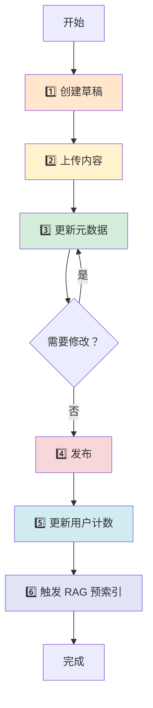
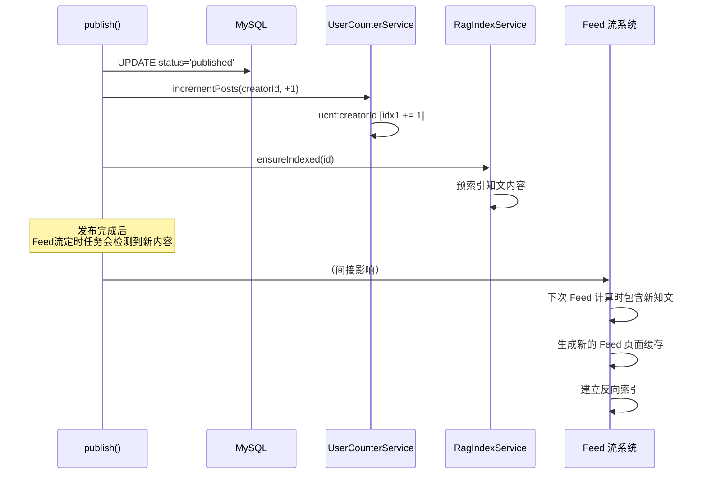
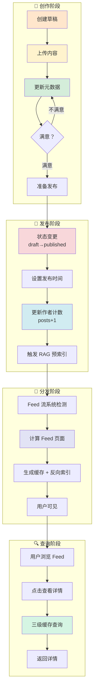

# 知文发布流程完整梳理

## 📋 概述

知文发布是一个多阶段的过程，从草稿创建到最终发布，涉及内容管理、缓存控制、计数更新和 RAG 索引等多个环节。

---

## 🎬 完整生命周期



---

## 🔹 步骤一：创建草稿

### **接口方法**
```java
@Transactional
public long createDraft(long creatorId)
```

### **核心逻辑**

```java
// 1. 生成全局唯一 ID（雪花算法）
long id = idGen.nextId();
// 示例：4194439168

// 2. 设置初始状态
Instant now = Instant.now();
KnowPost post = KnowPost.builder()
    .id(id)                          // 雪花 ID
    .creatorId(creatorId)            // 作者 ID
    .status("draft")                 // 状态：草稿
    .type("image_text")              // 类型：图文
    .visible("public")               // 默认可见性：公开
    .isTop(false)                    // 默认不置顶
    .createTime(now)
    .updateTime(now)
    .build();

// 3. 写入数据库
mapper.insertDraft(post);
// INSERT INTO knowpost (id, creator_id, status, type, visible, is_top, create_time, update_time)
// VALUES (4194439168, 123, 'draft', 'image_text', 'public', false, NOW(), NOW())

// 4. 返回草稿 ID
return id;
```

### **数据库状态**

| 字段 | 值 |
|------|-----|
| id | 4194439168 |
| creator_id | 123 |
| status | draft（草稿） |
| type | image_text（图文） |
| visible | public（公开） |
| is_top | false |
| content_object_key | NULL |
| title | NULL |
| tags | NULL |
| publish_time | NULL |

---

## 🔹 步骤二：上传内容

### **接口方法**
```java
@Transactional
public void confirmContent(long creatorId, long id, String objectKey, String etag, Long size, String sha256)
```

### **前置条件**

- ✅ OSS 直传已完成（前端直接上传到 OSS）
- ✅ 获得 `objectKey`、`etag`、`size`、`sha256`

---

### **核心逻辑**

```java
// 1️⃣ 缓存双删（防止脏读）
invalidateCache(id);
// 删除 Redis: knowpost:detail:{id}:v1
// 删除 Caffeine: knowpost:detail:{id}:v1

// 2️⃣ 构建更新对象
KnowPost post = KnowPost.builder()
    .id(id)
    .creatorId(creatorId)
    .contentObjectKey(objectKey)      // "knowpost/123/4194439168.md"
    .contentEtag(etag)                // ETag（OSS 生成的文件指纹）
    .contentSize(size)                // 文件大小（字节）
    .contentSha256(sha256)            // SHA256 校验和
    .contentUrl(publicUrl(objectKey)) // 公共访问 URL
    .updateTime(Instant.now())
    .build();

// 3️⃣ 更新数据库
int updated = mapper.updateContent(post);
// UPDATE knowpost 
// SET content_object_key=?, content_etag=?, content_size=?, content_sha256=?, content_url=?, update_time=?
// WHERE id=? AND creator_id=?

if (updated == 0) {
    throw new BusinessException(ErrorCode.BAD_REQUEST, "草稿不存在或无权限");
}

// 4️⃣ 再次删除缓存（双删保证一致性）
invalidateCache(id);

// 5️⃣ 触发 RAG 预索引（可选，草稿阶段可能被跳过）
try {
    ragIndexService.ensureIndexed(id);
} catch (Exception e) {
    log.warn("Pre-index after content confirm failed, post {}: {}", id, e.getMessage());
}
```

---

### **数据库状态变化**

| 字段 | 更新前 | 更新后 |
|------|--------|--------|
| content_object_key | NULL | "knowpost/123/4194439168.md" |
| content_etag | NULL | "\"5B2C3D4E5F6G7H8I\"" |
| content_size | NULL | 10240 |
| content_sha256 | NULL | "abc123..." |
| content_url | NULL | "https://bucket.oss.example.com/knowpost/123/4194439168.md" |
| update_time | T1 | T2 |

---

## 🔹 步骤三：更新元数据

### **接口方法**
```java
@Transactional
public void updateMetadata(
    long creatorId, long id, 
    String title, Long tagId, List<String> tags, 
    List<String> imgUrls, String visible, Boolean isTop, 
    String description
)
```

### **核心逻辑**

```java
// 1️⃣ 删除缓存
invalidateCache(id);

// 2️⃣ 构建更新对象
KnowPost post = KnowPost.builder()
    .id(id)
    .creatorId(creatorId)
    .title(title)                        // "这是一篇技术分享"
    .tagId(tagId)                        // 标签分类 ID
    .tags(toJsonOrNull(tags))            // ["Java", "Spring Boot"] → JSON 字符串
    .imgUrls(toJsonOrNull(imgUrls))      // ["url1", "url2"] → JSON 字符串
    .visible(visible)                    // "public" / "followers" / "private" ...
    .isTop(isTop)                        // true/false
    .description(description)            // 描述/摘要
    .type("image_text")
    .updateTime(Instant.now())
    .build();

// 3️⃣ 更新数据库
int updated = mapper.updateMetadata(post);
// UPDATE knowpost 
// SET title=?, tag_id=?, tags=?, img_urls=?, visible=?, is_top=?, description=?, update_time=?
// WHERE id=? AND creator_id=?

if (updated == 0) {
    throw new BusinessException(ErrorCode.BAD_REQUEST, "草稿不存在或无权限");
}

// 4️⃣ 再次删除缓存
invalidateCache(id);
```

---

### **数据库状态变化**

| 字段 | 更新前 | 更新后 |
|------|--------|--------|
| title | NULL | "这是一篇技术分享" |
| tag_id | NULL | 5 |
| tags | NULL | `["Java","Spring Boot"]` |
| img_urls | NULL | `["https://.../img1.jpg", "https://.../img2.jpg"]` |
| visible | public | public |
| is_top | false | false |
| description | NULL | "深入解析 Spring Boot 的核心原理..." |
| update_time | T2 | T3 |

---

### **可重复执行**

```
用户可以多次调用 updateMetadata：
第一次：设置标题和标签
第二次：修改可见性
第三次：调整置顶状态
...

每次都会：
✅ 更新数据库
✅ 删除缓存
```

---

## 🔹 步骤四：发布草稿

### **接口方法**
```java
@Transactional
public void publish(long creatorId, long id)
```

### **核心逻辑**

```java
// 1️⃣ 执行发布操作
int updated = mapper.publish(id, creatorId);
// UPDATE knowpost 
// SET status='published', publish_time=NOW(), update_time=NOW()
// WHERE id=? AND creator_id=? AND status='draft'

if (updated == 0) {
    throw new BusinessException(ErrorCode.BAD_REQUEST, "草稿不存在或无权限");
}

// 2️⃣ 更新用户维度的计数（异步容错）
try {
    userCounterService.incrementPosts(creatorId, 1);
    // ucnt:123 [idx1 += 1]  ← 已发布知文数 +1
} catch (Exception ignored) {
    // 失败不影响主流程
}

// 3️⃣ 触发 RAG 预索引（减少首次问答冷启动）
try {
    ragIndexService.ensureIndexed(id);
} catch (Exception e) {
    log.warn("Pre-index after publish failed, post {}: {}", id, e.getMessage());
}

// ✅ 注意：这里没有显式删除缓存
// 因为状态变更会导致后续查询时重新构建缓存
```

---

### **数据库状态变化**

| 字段 | 更新前 | 更新后 |
|------|--------|--------|
| status | draft（草稿） | published（已发布） |
| publish_time | NULL | 2024-03-06 14:30:00 |
| update_time | T3 | T4 |

---

### **发布后的连锁反应**



---

## 🔹 步骤五：其他辅助操作

### **1. 设置置顶**

```java
@Transactional
public void updateTop(long creatorId, long id, boolean isTop) {
    invalidateCache(id);  // 先删缓存
    
    int updated = mapper.updateTop(id, creatorId, isTop);
    // UPDATE knowpost SET is_top=? WHERE id=? AND creator_id=?
    
    if (updated == 0) {
        throw new BusinessException(ErrorCode.BAD_REQUEST, "草稿不存在或无权限");
    }
    
    invalidateCache(id);  // 再删缓存（双删）
}
```

---

### **2. 设置可见性**

```java
@Transactional
public void updateVisibility(long creatorId, long id, String visible) {
    // 校验可见性取值
    if (!isValidVisible(visible)) {
        throw new BusinessException(ErrorCode.BAD_REQUEST, "可见性取值非法");
    }
    
    invalidateCache(id);
    
    int updated = mapper.updateVisibility(id, creatorId, visible);
    // UPDATE knowpost SET visible=? WHERE id=? AND creator_id=?
    
    if (updated == 0) {
        throw new BusinessException(ErrorCode.BAD_REQUEST, "草稿不存在或无权限");
    }
    
    invalidateCache(id);
}

private boolean isValidVisible(String visible) {
    return switch (visible) {
        case "public", "followers", "school", "private", "unlisted" -> true;
        default -> false;
    };
}
```

**可见性说明：**

| 值 | 含义 |
|----|------|
| public | 公开（所有人可见） |
| followers | 仅粉丝可见 |
| school | 仅本校可见 |
| private | 仅自己可见 |
| unlisted | 不公开（通过链接访问） |

---

### **3. 软删除**

```java
@Transactional
public void delete(long creatorId, long id) {
    invalidateCache(id);
    
    int updated = mapper.softDelete(id, creatorId);
    // UPDATE knowpost SET status='deleted', update_time=? WHERE id=? AND creator_id=?
    
    if (updated == 0) {
        throw new BusinessException(ErrorCode.BAD_REQUEST, "草稿不存在或无权限");
    }
    
    invalidateCache(id);
}
```

---

## 📊 完整数据流图



---

## 🎯 关键设计要点

### **1. 事务一致性**

所有写操作都使用 `@Transactional` 注解：

```java
@Transactional
public void publish(long creatorId, long id) {
    // ✅ 数据库操作
    mapper.publish(id, creatorId);
    
    // ✅ 计数更新（即使失败也不回滚）
    try {
        userCounterService.incrementPosts(creatorId, 1);
    } catch (Exception ignored) {}
    
    // ✅ RAG 索引（即使失败也不回滚）
    try {
        ragIndexService.ensureIndexed(id);
    } catch (Exception e) {
        log.warn("...");
    }
}
```

**特点：**
- ✅ 核心操作（数据库）在事务内
- ✅ 辅助操作（计数、RAG）异常不影响主流程
- ✅ 最终一致性设计

---

### **2. 缓存双删模式**

```java
@Transactional
public void updateMetadata(...) {
    // 🔹 第一次删除（防止读到旧数据）
    invalidateCache(id);
    
    // 🔹 更新数据库
    mapper.updateMetadata(post);
    
    // 🔹 第二次删除（防止并发写导致脏数据）
    invalidateCache(id);
}
```

**为什么双删？**

```
场景：并发更新

T1: 线程 A 删除缓存
T2: 线程 B 查询缓存 → 未命中 → 查 DB（旧数据） → 写入缓存
T3: 线程 A 更新 DB
T4: 线程 A 再次删除缓存 ← 如果没有这次删除，缓存就是脏的！
```

---

### **3. SingleFlight 防击穿**

```java
// 使用 ConcurrentHashMap 实现锁机制
private final ConcurrentHashMap<String, Object> singleFlight = new ConcurrentHashMap<>();

Object lock = singleFlight.computeIfAbsent(pageKey, k -> new Object());
synchronized (lock) {
    // 双重检查
    String again = redis.opsForValue().get(pageKey);
    if (resp != null) {
        return resp;  // 已被其他线程填充
    }
    
    // 查库...
    
    singleFlight.remove(pageKey);
}
```

**作用：**
- ✅ 防止缓存击穿
- ✅ 避免惊群效应
- ✅ 减少数据库压力

---

### **4. 热点自动延期**

```java
private void recordHotKeyAndExtendTtl(long id, String detailPageKey) {
    // 记录热度
    String hotKeyId = "knowpost:" + id;
    hotKey.record(hotKeyId);
    
    // 根据热度动态调整 TTL
    int target = hotKey.ttlForPublic(baseTtl, hotKeyId);
    
    // 延长详情页缓存
    Long detailTtl = redis.getExpire(detailPageKey);
    if (detailTtl < target) {
        redis.expire(detailPageKey, Duration.ofSeconds(target));
    }
    
    // 延长 Feed 流片段缓存
    String itemKey = "feed:item:" + id;
    Long itemTtl = redis.getExpire(itemKey);
    if (itemTtl < target) {
        redis.expire(itemKey, Duration.ofSeconds(target));
    }
}
```

**效果：**
- 🔥 热点内容：TTL 自动延长（如 1 小时）
- ❄️ 冷门内容：TTL 正常过期（如 60 秒）
- 💡 节省 Redis 内存

---

## 📝 总结

### **完整流程时间线**

```
T0:     用户点击"创作"
          ↓
T1:     createDraft() → 获得草稿 ID
          ↓
T2:     前端 OSS 直传内容
          ↓
T3:     confirmContent() → 绑定内容信息
          ↓
T4:     updateMetadata() → 设置标题/标签/可见性
          ↓
T5:     用户点击"发布"
          ↓
T6:     publish() → 状态变更为 published
          ↓
T6+1s:  Feed 流系统检测到新知文
          ↓
T6+2s:  生成 Feed 页面缓存 + 反向索引
          ↓
T6+5s:  其他用户刷到这篇知文
```

---

### **各模块协作关系**

| 模块 | 职责 | 调用时机 |
|------|------|---------|
| **KnowPostService** | 知文 CRUD | 全程 |
| **SnowflakeIdGenerator** | 生成唯一 ID | createDraft |
| **OSS Storage** | 内容存储 | confirmContent（前端直传） |
| **UserCounterService** | 更新作者计数 | publish |
| **RagIndexService** | RAG 预索引 | confirmContent + publish |
| **Feed 流系统** | 内容分发 | publish 后自动触发 |
| **Redis/Caffeine** | 多级缓存 | 所有查询操作 |

---

### **与其他系统的集成**

```
知文发布系统
  ↓
【计数系统】← userCounterService.incrementPosts()
  ↓
【RAG 系统】← ragIndexService.ensureIndexed()
  ↓
【Feed 流系统】← 自动检测 published 状态的知文
  ↓
【缓存系统】← 三级缓存架构
```

这是一个完整的、高可用的内容发布系统！🎯
